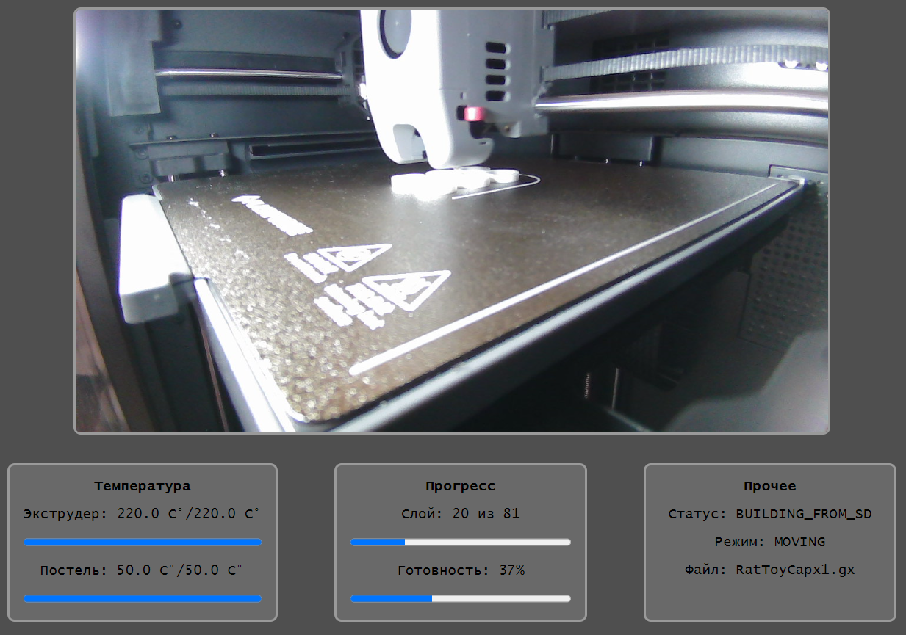
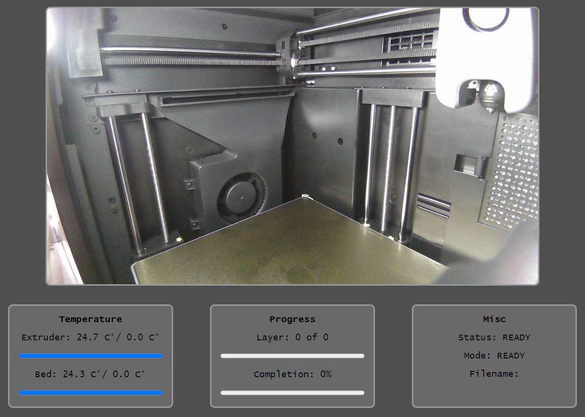

# Flash Forge Adventurer 5M API

Данный проект позволяет выполнять сетевое взаимодействие с принтером, плюс даёт
простой GUI. Это неофициальное решение, используйте на свой страх и риск.

Оно использует API, предоставляемое принтерами `Flash Forge` по умолчанию и не
требует никаких доработок принтера (работает "из коробки").

Для тех случаев, когда у вас принтер со стандартной прошивкой и вы
не хотите в неё лезть. Но было бы неплохо иметь возможность, например, узнать
процент готовности печати. Тестировалось в работе
с `Flash Forge Adventurer 5M Pro`, вероятно будет работать с другими принтерами
данного производителя.

[Читать документацию](./doc/ru.md)

При разработке использованы материалы:

1. https://github.com/DanMcInerney/flashforge-finder-api
2. https://github.com/01F0/flashforge-finder-api/tree/master
3. https://github.com/acgy/flashforge-finder-php-api/tree/main

---

This project gives you API to interact with the printer and also simple GUI.
This API is not official, use on your own risk.

Code uses API that usually comes with `Flash Forge` printers and do not require
any modification in the printer (works out of the box).

It is written for cases when you have printer with standard firmware, and you
do not want to modify it. But still want to get, for example, print progress.
Application was tested with  `Flash Forge Adventurer 5M Pro`, but probably will
work with other printers of this manufacturer.

[Read the docs](./doc/en.md)

This project is based on:

1. https://github.com/DanMcInerney/flashforge-finder-api
2. https://github.com/01F0/flashforge-finder-api/tree/master
3. https://github.com/acgy/flashforge-finder-php-api/tree/main
